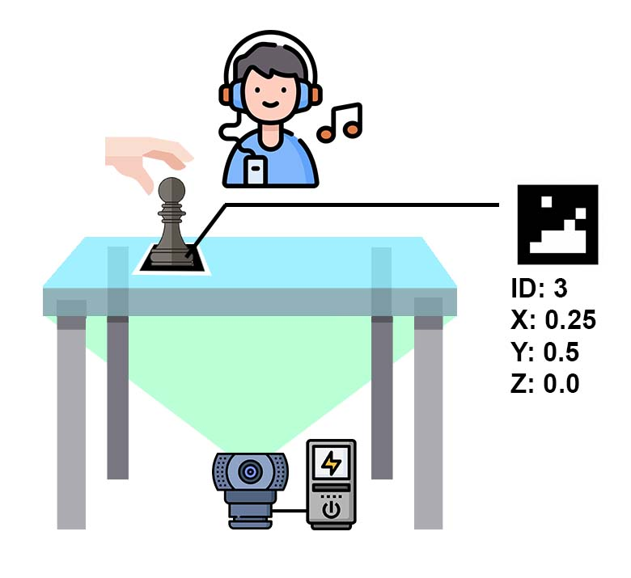
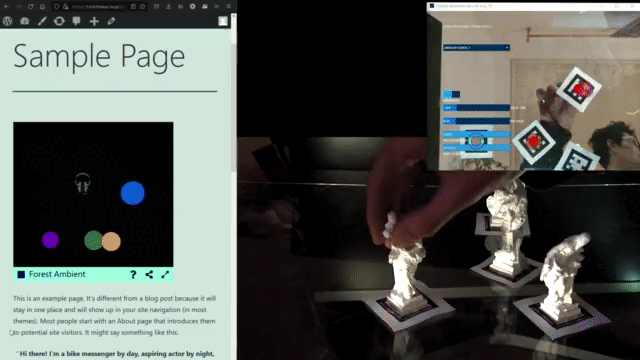
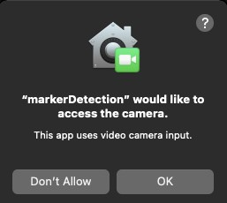
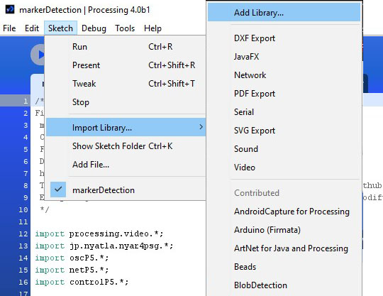

# Fiducial marker tracking with OSC and Websocket out
## Bachelor thesis by Vilém Jonák, supervision Vojtech Leischner
Standalone fiducial markers tracking using a web camera. The application has a graphical user interface and is very simple to use. Tracking data are sent to a selected IP address as WebSocket string or OSC. Software is part of the interface to enable spatial audio rendering controlled with haptics interface. However, it can be used for any other use-cases that involve fiducial marker tracking. Developed by Vilém Jonák as part of bachelor thesis at Czech Technical University in Prague under the tutelage of Vojtech Leischner. Supported by Human interaction department CVUT https://dcgi.fel.cvut.cz/

## Video demonstration - streaming tracked data into web app

## TODO LIST
* enable perspective deformation of camera image to support camera from angle setup
* create video demo
* port to raspberry pi - add camera exposore control
* enable for different type of markers and let user control the max number of markers tracked
* besides tracked location send the lifetime as well - can be used for fade out

## Download
* [Windows64bit](https://mega.nz/file/BVoD1ayK#eIv6blfXmK3ppnHq7AaB2BRscRLk_Ixk-6hIt53vq90) - version 1.1
* [Windows64bit](https://mega.nz/file/pBZVxQoS#CQicvcYtOaZTkJv2YbP3XL4akb-QZu1OEyeFXb7_AoM) - version 1.0
* [Linux64bit](https://mega.nz/file/tFQVWKoT#WH5LBp3tQRrBptjvUZaxjd0AG1g5zXfEui9OqQN1vr8) - version 1.0
* [MacOS](https://mega.nz/file/0Zo1lSpY#uLeYLISbpn_arnBgx66OWgjvhM-kCEfSS09V0xbd7sM) - version 1.1
* [MacOS](https://mega.nz/file/NRIlxQRK#BeU4kAl60qU1KTf7Ii2AmIxcMvEjUTDoPEW0qywfckc) - version 1.0

Download links provide zipped archive with the tool. You don't need to install anything - just unzip it and run executable file. In case the above links are not working you can try [Google Drive mirror with BUILDS](https://drive.google.com/drive/folders/1Njwbk_lGTBMU1Iih-O9_Vx9QnXwMo9eV?usp=sharing). 

## &bdquo;Cite&ldquo;
If you use, modify or extend this software please cite like this:

@misc{jonak_leischner_2021, title={Marker Detection Software }, url={https://github.com/vilijonak/Bachelor-thesis/blob/main/README.md}, journal={GitHub}, publisher={Vilem Jonak}, author={Jonak, Vilem and Leischner, Vojtech}, year={2021}}

We have also included [github citation](./CITATION.cff) file so you can simply click copy paste in the side bar to get APA / BibTex format citation.

### Windows
Tested on Windows 10. It should work out of the box. Just double click the "markerDetection.exe" file. If you are using antivirus such as Windows Defender it will show warning - you can safely click "More info" and choose "Run anyway". Next time it should run without warning.

### MacOS
Tested on Big Sur 11.6. On MacOs you need to allow installation from unknown sources. Open the Apple menu > System Preferences > Security & Privacy > General tab. Under Allow apps downloaded from select App Store and identified developers. To launch the app simply Ctrl-click on its icon > Open or double click. Please wait a while until the application boots. On the first run it will ask you to allow the acces to the camera - click OK. Close the apllication and run it again - this time it should started with first camera found ( you can change the camera after that from the app menu ).

### Linux
Tested on Ubuntu 64bit. You can always run the app from the terminal. If using GUI and the app does not run when you double click the "markerDetection" file icon you need to change the settings of your file explorer. In Nautilus file explorer click the hamburger menu (three lines icon next to minimise icon ), select "preferences". Click on "behaviour" tab, in the "Executable Text Files" option select "Run them". Close the dialogue and double click the "markerDetection" file icon (bash script) - now it should start.

## Build instructions
In case you want to use the app without modifying source code you can simply download premade builds - refer to Download chapter above. In case you need to build the app yourself you will need Processing IDE https://processing.org/. You will also need all underlying libraries - to install libraries in Processing IDE click on "sketch" -> "import library" -> "add library". Type names of the dependencies into search box and click install. 

* video
* osc5
* Websockets
* nyar4psg

After that clone this repository and open markerDetection.pde inside source. In Processing IDE click "File" -> "Export application..." and choose the build you need.

## What is this good for?

## How to use it?
After unzipping simply double click the executable to run the application. 

Note that you can also adjust few settings.
* some settings - what it does TBD
* other one....TBD

## How does it work?
Under the hood the tool is programmed in Java Processing. For marker detection we are using NyARToolkit library for processing developed by Ryo Lizuka: https://github.com/nyatla/NyARToolkit-for-Processing/blob/master/README.EN.md and Control P5 for GUI https://github.com/sojamo/controlp5. For camera capture we rely on Video library based on Gstreamer https://processing.org/reference/libraries/video/index.html.

@misc{lizuka_2008, title={Nyartoolkit-for-processing/readme.en.md at master · NYATLA/nyartoolkit-for-processing}, url={https://github.com/nyatla/NyARToolkit-for-Processing/blob/master/README.EN.md}, journal={GitHub}, publisher={Ryo Iizuka}, author={Lizuka, Ryo}, year={2008}}

## Camera Calibration
We are using a general camera calibration model but you can create a custom one as well. Simply delete the camera_para.dat file and replace it with your own. Please refer to utility programs included with ARToolKit to calibrate your video camera if you want to achieve more precise results and to export the necessary file. See http://www.hitl.washington.edu/artoolkit/documentation/usercalibration.htm for more.

## MIT License
Copyright © 2021 Vilem Jonak, Vojtech Leischner

Permission is hereby granted, free of charge, to any person obtaining a copy of this software and associated documentation files (the “Software”), to deal in the Software without restriction, including without limitation the rights to use, copy, modify, merge, publish, distribute, sublicense, and/or sell copies of the Software, and to permit persons to whom the Software is furnished to do so, subject to the following conditions:

The above copyright notice and this permission notice shall be included in all copies or substantial portions of the Software.

THE SOFTWARE IS PROVIDED “AS IS”, WITHOUT WARRANTY OF ANY KIND, EXPRESS OR IMPLIED, INCLUDING BUT NOT LIMITED TO THE WARRANTIES OF MERCHANTABILITY, FITNESS FOR A PARTICULAR PURPOSE AND NONINFRINGEMENT. IN NO EVENT SHALL THE AUTHORS OR COPYRIGHT HOLDERS BE LIABLE FOR ANY CLAIM, DAMAGES OR OTHER LIABILITY, WHETHER IN AN ACTION OF CONTRACT, TORT OR OTHERWISE, ARISING FROM, OUT OF OR IN CONNECTION WITH THE SOFTWARE OR THE USE OR OTHER DEALINGS IN THE SOFTWARE.
